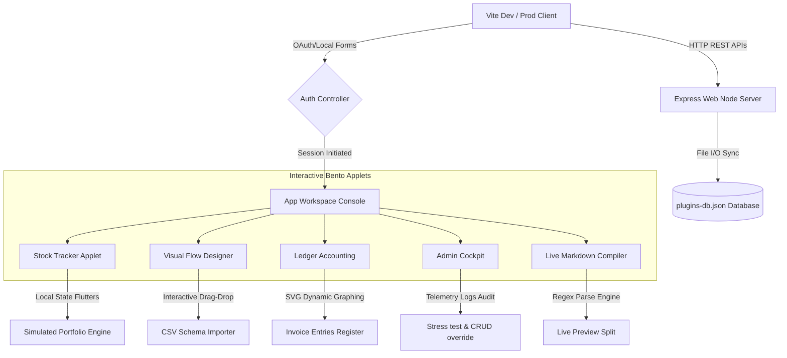

# SutharLabs Sovereign Engine - System & Architecture Documentation

Welcome to the official technical documentation for the **SutharLabs Sovereign Engine**. This document serves as a comprehensive guide to the system architecture, file structure, custom interactive components, local state persistence, rest endpoints, and Tailwind CSS v4 styling rules that power the SutharLabs workspace portal.

---

## 1. High-Level System Architecture

The SutharLabs platform is built as a highly unified full-stack system designed to simulate developer workflow controllers. It leverages a modern frontend coupled with a lightweight, high-performance mock state synchronization backend.



### Core Technologies
- **Frontend Core**: [React 19](https://react.dev/) + [TypeScript](https://www.typescriptlang.org/) for highly structured state management and safety.
- **Styling**: [Tailwind CSS v4](https://tailwindcss.com/) with curated ambient gradients and glassmorphism.
- **Backend Node Node**: [Express](https://expressjs.com/) for local workspace persistence and REST registries.
- **Compiler/Bundler**: [Vite](https://vite.dev/) & [esbuild](https://esbuild.github.io/) for sub-millisecond hot-reloading and fast production builds.

---

## 2. Directory Structure Walkthrough

Below is a breakdown of the primary repository directories and configuration files:

```text
sutharlabs_web/
├── .env.example             # Template for local environment parameters
├── .gitignore               # Exclusions list for node_modules, logs, and credentials
├── index.html               # Main SPA entry page
├── metadata.json            # Application metadata definitions
├── package.json             # Core dependency manifest and build targets
├── plugins-db.json          # Local file-system database for storing MCP plugins
├── server.ts                # Express backend application hosting the Vite middleware
├── tsconfig.json            # Strict TypeScript compilation rules
├── vite.config.ts           # Bundler plugins and server options
└── src/
    ├── App.tsx              # Root controller handling landing routing and layout tabs
    ├── index.css            # Custom CSS definitions, glassmorphism, and color themes
    ├── main.tsx             # Entry point mounting the React virtual DOM tree
    ├── types.ts             # Global TypeScript type declaration interfaces
    └── components/          # Reusable view components
        ├── LandingPage.tsx       # Corporate landing page & portfolio showcase
        ├── AuthPage.tsx          # Sign-in/Sign-up local & social session initiator
        ├── StockTrackerView.tsx  # Dynamic NVDA charts & trade console
        ├── FlowDesignerView.tsx  # Bezier node orchestrator & CSV drop-zone
        ├── AccountingView.tsx     # Financial ledgers & custom SVG invoice bars
        ├── AdminConsoleView.tsx  # System maintenance, stress testing, & CRUD
        └── MutedMarkdownView.tsx # Custom regex markdown preview split
```

---

## 3. Interactive Bento Applets Analysis

The Sovereign Engine features five custom-built developer panels, each bound to reactive hooks and shared logging streams.

### A. NVDA Stock Tracker (`StockTrackerView.tsx`)
This applet simulates a real-time predictive analytics console displaying financial ticks and Bollinger calculations.
- **SVG Coordinate Calculations**: Plots fluctuating lines across a neon matrix backdrop using coordinates calculated dynamically from the prices array:
  $$\text{Coordinate } X = \frac{idx}{\text{prices.length} - 1} \times (\text{svgWidth} - 40) + 10$$
  $$\text{Coordinate } Y = \text{svgHeight} - \frac{\text{price} - \text{minPrice}}{\text{maxPrice} - \text{minPrice}} \times (\text{svgHeight} - 40) - 20$$
- **Simulated Trade Console**: Manages a local portfolio state (`cash`, `shares`, `buyPrice`). It updates capital reserves and position averages automatically on every executed BUY or SELL order.
- **Terminal log output**: Includes a 3-tab layout supporting real-time `AGENT_LOGS`, system compiler outputs (`OUTPUT`), and hardware processes (`DEBUG_CONSOLE`).

### B. Visual Flow Designer (`FlowDesignerView.tsx`)
A vector node orchestration tool allowing users to map pipelines visually.
- **Bezier Wires Connection Layer**: Computes cubic Bezier curves in SVG dynamically between node anchors using:
  ```typescript
  const drawBezierLine = (x1: number, y1: number, x2: number, y2: number) => {
    const cp1x = x1 + (x2 - x1) / 2;
    const cp1y = y1;
    const cp2x = x1 + (x2 - x1) / 2;
    const cp2y = y2;
    return `M ${x1} ${y1} C ${cp1x} ${cp1y}, ${cp2x} ${cp2y}, ${x2} ${y2}`;
  };
  ```
- **Coordinate Restraints**: Safe drag limits constraint coordinates relative to the DOM canvas bounds (`getBoundingClientRect`).
- **CSV Data Schema Dropper**: Listens to standard drag-and-drop file operations, allowing developers to inject local mock schema values directly into execution states.

### C. Ledger Accounting (`AccountingView.tsx`)
A secure ledger applet tracking corporate invoices and cycle margins.
- **Proportion Cycles Visualizer**: Displays layout bars using custom SVG coordinates mapped dynamically based on invoice volume weights relative to a capping threshold ($15,000 baseline).
- **Formula Derivations**: Computes aggregate metrics dynamically on every render to support live manual entries:
  $$\text{Total Invoice Amount} = \sum (\text{invoice.amount})$$
  $$\text{Outstanding Balance} = \sum (\text{invoice.amount} \mid \text{status} = \text{"Pending"})$$
- **Filtering Grid**: Features real-time string match searching against client names and invoice tracking IDs.

### D. Admin Command Center (`AdminConsoleView.tsx`)
A privileged console for maintaining workspace health, editing directories, and deploying integrations.
- **Telemetry Indicators**: Simulates edge server activity (CPU, RAM, Sync state, gateway peers) with periodic fluctuations using a speed coefficient multiplier.
- **Security Lockdowns & Overrides**: Restricts view access by verifying the active user session role. An elevation bypass button allows developers to mutate credentials instantly.
- **Stress-Test Trigger**: Stress testing triggers high WebSocket stress anomalies, spiking the simulation multiplier before returning coordinates to balance profiles.
- **Directory Account CRUD**: Renders an editable matrix populated from `localStorage` (`sutharlabs_registered_users`), granting administrative CRUD tools (create new accounts, ban users, modify credentials).
- **Outward Plugin Marketplace Publisher**: Communicates directly with the Express API endpoints to sync newly published MCP servers with the storefront.

### E. Live Markdown Compiler (`MutedMarkdownView.tsx`)
A split editor-viewer pane showcasing local readmes and schema documentation.
- **Regex Parse Compiler**: Features a lightweight rendering engine parsing Markdown tokens into raw HTML on every keypress:
  - **Headings**: `^# (.*$)` $\rightarrow$ `<h1>`
  - **Blockquotes**: `^\s*&gt;\s+(.*$)` $\rightarrow$ `<blockquote>`
  - **Fenced Code Blocks**: `/\`\`\`([\s\S]*?)\`\`\`/g` $\rightarrow$ `<pre><code>`
  - **Inline Code**: `/`([^`]+)`/g` $\rightarrow$ `<code>`
  - **List Items**: `^[-*+]\s+(.*$)` $\rightarrow$ `<li>` wrapped dynamically inside `<ul>` containers.

---

## 4. Backend REST API Server (`server.ts`)

The backend is built around a lightweight Node.js Express server that manages the workspace data registry in a local file-system database (`plugins-db.json`).

### REST API Mappings

| Method | Endpoint | Description | Validation |
| :--- | :--- | :--- | :--- |
| **GET** | `/api/health` | Diagnostic check reporting active environment mode. | None |
| **GET** | `/api/plugins` | Fetches the full list of active MCP plugins from `plugins-db.json`. | None |
| **POST** | `/api/plugins` | Registers and saves a new plugin definition. | Name & Description required |
| **DELETE** | `/api/plugins/:id` | Purges and unpublishes an MCP plugin listing by ID. | Plugin must exist |

### Database Sync Pattern
Plugins are read and written synchronously to prevent race conditions during stress testing or simultaneous client sessions:
- **`getPluginsFromDB()`**: Checks if `plugins-db.json` exists. If missing, it initializes the database with a static array of default DevOps, AI, and finance plugins.
- **`savePluginsToDB(plugins)`**: Synchronously commits memory array modifications to the local database file using formatting:
  `fs.writeFileSync(DB_FILE, JSON.stringify(plugins, null, 2), "utf-8")`

---

## 5. Styling Design System (`src/index.css`)

SutharLabs is styled using **Tailwind CSS v4**'s advanced CSS-variables-based `@theme` directive, delivering a premium, cohesive dark mode interface.

### Curated Color Tokens
- **Backdrop Colors**: `#050505` (Core void space), `#0e0e10` (Lowest containers), `#131315` (Header and explorer bars).
- **Neon Accent Indicators**: 
  - Cyan (`#00dbe7` / `#74f5ff`): Highlights primary actions, code structures, and stock trackers.
  - Purple (`#ce5dff` / `#ebb2ff`): Highlights visual node workflows and pending ledger balances.
  - Emerald (`#00e476` / `#00fb83`): Highlights paid ledgers, success messages, and online status.

### Custom CSS Classes
- **Glassmorphism Panels (`.glass-panel`)**: Uses heavy backdrop filters and fine border borders for a premium, clean aesthetic:
  ```css
  .glass-panel {
    background: rgba(18, 18, 20, 0.82);
    backdrop-filter: blur(20px);
    -webkit-backdrop-filter: blur(20px);
    border: 1px solid rgba(255, 255, 255, 0.05);
  }
  ```
- **Neon Accents (`.neon-border-active`, `.neon-text-glow`)**: Adds subtle outer glows to draw user attention.
- **Bento Grid Alignment (`.chart-grid`)**: Generates an elegant, semi-transparent developer grid:
  ```css
  .chart-grid {
    background-image: 
      linear-gradient(to right, rgba(255, 255, 255, 0.03) 1px, transparent 1px),
      linear-gradient(to bottom, rgba(255, 255, 255, 0.03) 1px, transparent 1px);
    background-size: 40px 40px;
  }
  ```

---

*This documentation is maintained by SutharLabs Systems Corp. For core mutations, consult the local `package.json` configurations.*
