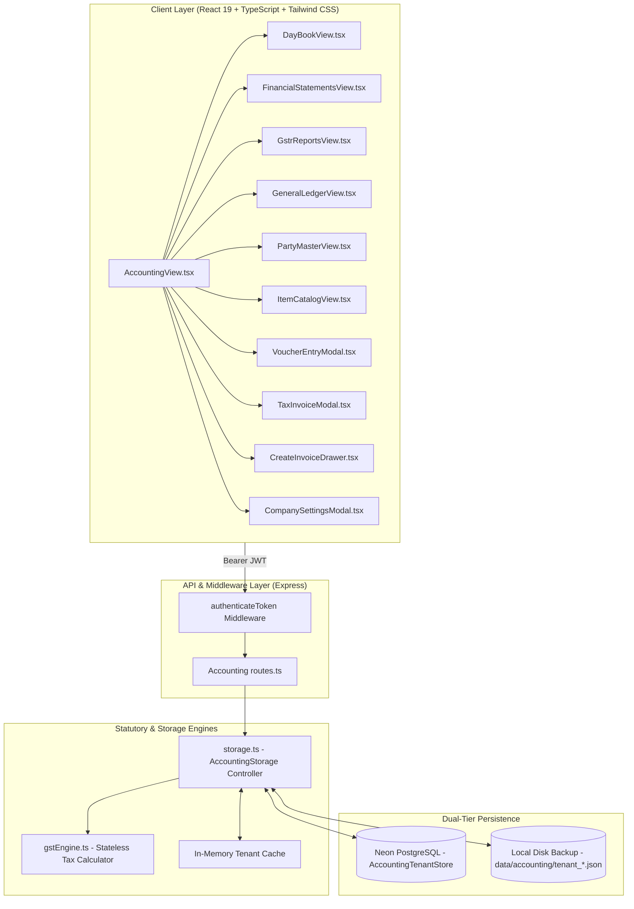

# Accounting Plugin: Architecture, Code Logic & Multi-Tenant Engine Specification

> **Plugin Identifier:** `wp_accounting`  
> **Active Release:** `v0.2.1` (Beta)  
> **Route:** `/workspace/accounting`  
> **API Mounts:** `/api/plugins/wp_accounting/*`, `/api/invoices` (legacy alias)  
> **Compliance Standard:** CBIC Indian GST Rules (2017–2026), Section 31 CGST Act, Rule 46 Tax Invoicing, Companies Act 2013 (Schedule III Financial Statements)  
> **Design Parity:** Tally Prime, SAP ERP, Frappe Books & ERPNext India Compliance  

---

## 1. Executive Architecture Overview

The **Accounting** plugin (`wp_accounting`) is an enterprise-grade ERP and financial accounting engine built natively into the SutharLabs platform. It combines strict Indian statutory GST compliance with the high-speed keyboard-driven UX of **Tally Prime** and the structured financial reporting of **SAP ERP**.

### High-Level Architectural Diagram



---

## 2. Directory & Module Breakdown

| Path | File | Role & Architectural Scope |
| :--- | :--- | :--- |
| `src/plugins/Accounting/` | [`manifest.ts`](file:///d:/Code/SutharLabs/website/src/plugins/Accounting/manifest.ts) | Workspace plugin descriptor declaring ID (`wp_accounting`), version (`0.2.1`), category (`Operations`), and launch route. |
| `src/plugins/Accounting/` | [`manifest.json`](file:///d:/Code/SutharLabs/website/src/plugins/Accounting/manifest.json) | Bundled manifest consumed by the encrypted packaging and verification pipeline. |
| `src/plugins/Accounting/` | [`types.ts`](file:///d:/Code/SutharLabs/website/src/plugins/Accounting/types.ts) | Strict TypeScript interfaces for Company, Parties, Items, Invoices, Vouchers, Financial Statements, and GSTR summaries. |
| `src/plugins/Accounting/` | [`gstEngine.ts`](file:///d:/Code/SutharLabs/website/src/plugins/Accounting/gstEngine.ts) | Pure statutory Indian GST computation engine: supply type detection, tax slab calculation, 15-digit GSTIN validation, IRN hash generation, QR payload, and Indian currency word converters. |
| `src/plugins/Accounting/` | [`storage.ts`](file:///d:/Code/SutharLabs/website/src/plugins/Accounting/storage.ts) | Multi-tenant storage controller orchestrating tenant scoping, Neon PostgreSQL synchronization, and local disk backup. |
| `src/plugins/Accounting/` | [`routes.ts`](file:///d:/Code/SutharLabs/website/src/plugins/Accounting/routes.ts) | Express route handlers mounting endpoints under `/api/plugins/wp_accounting/` with user session validation. |
| `src/plugins/Accounting/components/` | [`DayBookView.tsx`](file:///d:/Code/SutharLabs/website/src/plugins/Accounting/components/DayBookView.tsx) | Daily transaction register displaying F4–F9 vouchers, receipts, payments, and contra transactions. |
| `src/plugins/Accounting/components/` | [`FinancialStatementsView.tsx`](file:///d:/Code/SutharLabs/website/src/plugins/Accounting/components/FinancialStatementsView.tsx) | Multi-tab corporate reporting: Schedule III Balance Sheet, Profit & Loss Account, Grouped Trial Balance, AR/AP Aging, and Bank Reconciliation Statement (BRS). |
| `src/plugins/Accounting/components/` | [`GstrReportsView.tsx`](file:///d:/Code/SutharLabs/website/src/plugins/Accounting/components/GstrReportsView.tsx) | GSTR-1 (Tables B2B, B2CL, B2CS, Table 12 HSN Summary) and GSTR-3B tax return analyzer with official GST Offline Tool JSON exporter. |
| `src/plugins/Accounting/components/` | [`GeneralLedgerView.tsx`](file:///d:/Code/SutharLabs/website/src/plugins/Accounting/components/GeneralLedgerView.tsx) | Classical double-entry T-account general ledger with real-time balance reconciliation. |
| `src/plugins/Accounting/components/` | [`PartyMasterView.tsx`](file:///d:/Code/SutharLabs/website/src/plugins/Accounting/components/PartyMasterView.tsx) | Customer and Vendor master registry with GSTIN validation, State mapping, credit days, and opening balance tracking. |
| `src/plugins/Accounting/components/` | [`ItemCatalogView.tsx`](file:///d:/Code/SutharLabs/website/src/plugins/Accounting/components/ItemCatalogView.tsx) | Products and Services master with HSN/SAC codes, default units, GST tax slabs, and valuation. |
| `src/plugins/Accounting/components/` | [`VoucherEntryModal.tsx`](file:///d:/Code/SutharLabs/website/src/plugins/Accounting/components/VoucherEntryModal.tsx) | Modal dialog for rapid F4 (Contra), F5 (Payment), F6 (Receipt), F7 (Journal), F8 (Sales), and F9 (Purchase) voucher creation. |
| `src/plugins/Accounting/components/` | [`CreateInvoiceDrawer.tsx`](file:///d:/Code/SutharLabs/website/src/plugins/Accounting/components/CreateInvoiceDrawer.tsx) | Slide-over drawer for issuing GST Rule 46 compliant tax invoices with real-time multi-line tax recalculation. |
| `src/plugins/Accounting/components/` | [`TaxInvoiceModal.tsx`](file:///d:/Code/SutharLabs/website/src/plugins/Accounting/components/TaxInvoiceModal.tsx) | Printable, exportable Indian GST Tax Invoice document with authentic typography, bank details, IRN, and QR code. |
| `src/plugins/Accounting/components/` | [`CompanySettingsModal.tsx`](file:///d:/Code/SutharLabs/website/src/plugins/Accounting/components/CompanySettingsModal.tsx) | Configuration modal for enterprise GSTIN, PAN, bank credentials, invoice prefixes, and composition scheme flags. |
| `src/components/` | [`AccountingView.tsx`](file:///d:/Code/SutharLabs/website/src/components/AccountingView.tsx) | Main UI container hosting the header deck, KPI tiles, navigation hotbar, F4–F9 keyboard shortcut listeners, and sub-views. |

---

## 3. Statutory GST Engine Logic ([`gstEngine.ts`](file:///d:/Code/SutharLabs/website/src/plugins/Accounting/gstEngine.ts))

The statutory calculation logic is strictly decoupled and stateless:

### 3.1 Place of Supply (POS) & Supply Type Determination
Under the Indian Goods and Services Tax Act:
- **Intra-State Supply**: When the supplier's state code matches the Place of Supply (POS) state code:
  $$\text{CGST Rate} = \frac{\text{GST Rate}}{2}, \quad \text{SGST Rate} = \frac{\text{GST Rate}}{2}, \quad \text{IGST Rate} = 0$$
- **Inter-State Supply**: When the supplier's state code differs from the Place of Supply (POS) state code:
  $$\text{IGST Rate} = \text{GST Rate}, \quad \text{CGST Rate} = 0, \quad \text{SGST Rate} = 0$$

```typescript
export function determineSupplyType(supplierStateCode: string, placeOfSupplyStateCode: string): SupplyTypeResult {
  const normSupplier = supplierStateCode?.trim().padStart(2, '0');
  const normPos = placeOfSupplyStateCode?.trim().padStart(2, '0');
  const isInterState = normSupplier !== normPos;
  ...
}
```

### 3.2 Item-Level Tax & Cess Calculation
Taxes are computed at line-item level with 2-decimal rounded precision:
$$\text{Taxable Value} = (\text{Quantity} \times \text{Rate}) - \text{Discount Amount}$$
$$\text{CGST Amount} = \text{Taxable Value} \times \frac{\text{CGST Rate}}{100}$$
$$\text{SGST Amount} = \text{Taxable Value} \times \frac{\text{SGST Rate}}{100}$$
$$\text{IGST Amount} = \text{Taxable Value} \times \frac{\text{IGST Rate}}{100}$$
$$\text{Cess Amount} = \text{Taxable Value} \times \frac{\text{Cess Rate}}{100}$$

### 3.3 Indian Currency Word Converter (`amountInWordsIndian`)
Complies with Indian numbering format (Lakhs and Crores rather than Millions/Billions):
- Grouping: Hundreds, then pairs of two digits (e.g., `12,34,567.00`).
- Words: `"Rupees Twelve Lakh Thirty Four Thousand Five Hundred Sixty Seven Only"`.

### 3.4 Cryptographic E-Invoicing (IRN & Signed QR)
- **IRN (Invoice Reference Number)**: Generated via SHA-256 hash over the combined tuple:
  $$\text{IRN} = \text{SHA256}(\text{SupplierGSTIN} + \text{FiscalYear} + \text{DocType} + \text{DocNumber})$$
- **Signed QR Code Payload**: Contains standard 8-attribute JSON string (`sellerGstin`, `buyerGstin`, `docNo`, `docDate`, `totalValue`, `itemCount`, `irn`) rendered visually on tax invoices.

---

## 4. Multi-Tenant Architecture & Database Persistence

### 4.1 Database Model (`AccountingTenantStore`)
Defined in [`prisma/schema.prisma`](file:///d:/Code/SutharLabs/website/prisma/schema.prisma) and deployed to **Neon PostgreSQL**:

```prisma
model AccountingTenantStore {
  id             String   @id @default(uuid())
  userEmail      String   @unique @map("user_email")
  companyProfile String   @default("{}") @map("company_profile")
  parties        String   @default("[]")
  items          String   @default("[]")
  invoices       String   @default("[]")
  vouchers       String   @default("[]")
  updatedAt      DateTime @default(now()) @updatedAt @map("updated_at")

  user           User?    @relation(fields: [userEmail], references: [email], onDelete: Cascade)

  @@map("accounting_tenant_stores")
}
```

### 4.2 Multi-Tier Storage Controller ([`storage.ts`](file:///d:/Code/SutharLabs/website/src/plugins/Accounting/storage.ts))

To ensure sub-millisecond read performance, resilience against serverless container recycling, and 100% data durability, the storage architecture operates in 3 coordinated tiers:

```
┌────────────────────────────────────────────────────────┐
│                   AccountingStorage                    │
└────────────────────────────────────────────────────────┘
                           │
             ┌─────────────┴─────────────┐
             ▼                           ▼
      loadTenantData()             saveTenantData()
             │                           │
  1. Check Memory Cache          1. Update Memory Cache
             │                           │
  2. Query Neon PostgreSQL       2. Write Local Disk Backup
             │                           │
  3. Fallback Local Disk         3. Upsert Neon PostgreSQL
             │
  4. Seed New Tenant Default
```

1. **Tier 1 (In-Memory Cache - `tenantMemoryCache`)**:
   - Stores parsed JSON objects in memory keyed by normalized `userEmail.toLowerCase().trim()`.
   - Guarantees immediate UI responsiveness.
2. **Tier 2 (PostgreSQL Persistence via Neon & Prisma)**:
   - High-durability ACID storage in the cloud database.
   - On mutation (`saveTenantData`), writes an asynchronous `upsert` matching `where: { userEmail }`.
3. **Tier 3 (Local Disk Write-Through Backup)**:
   - Persists serialized JSON to `data/accounting/tenant_<slug>.json` (falling back to `os.tmpdir()` in serverless containers).
   - Guarantees offline local development works seamlessly even if external DB credentials are unset or unreachable.

### 4.3 Automatic Tenant Initialization
When an authenticated user loads the Accounting suite for the very first time:
1. `loadTenantData` discovers no prior database row or disk file.
2. It initializes a clean, personal tenant containing standard Chart of Accounts, default Company Profile, pre-configured GST tax rates, and demonstration vouchers.
3. Automatically triggers a background save to Neon PostgreSQL, establishing the user's permanent tenant store.

---

## 5. Route Architecture & Authentication ([`routes.ts`](file:///d:/Code/SutharLabs/website/src/plugins/Accounting/routes.ts))

All endpoints enforce `authenticateToken` middleware and pass the verified `req.user.email` into `AccountingStorage`:

```typescript
function getUserEmail(req: any): string {
  return req.user?.email || 'default@sutharlabs.com';
}
```

### Endpoint Registry

| Method | Endpoint | Description | Scope |
| :--- | :--- | :--- | :--- |
| `GET` | `/api/plugins/wp_accounting/company` | Fetches active tenant's legal entity & GST profile | Tenant Scoped |
| `PUT` | `/api/plugins/wp_accounting/company` | Updates GSTIN, PAN, bank details, and invoice prefixes | Tenant Scoped |
| `GET` | `/api/plugins/wp_accounting/customers` | Retrieves all customer and vendor parties | Tenant Scoped |
| `POST` | `/api/plugins/wp_accounting/customers` | Registers new party with GSTIN validation | Tenant Scoped |
| `GET` | `/api/plugins/wp_accounting/items` | Retrieves inventory & service catalog | Tenant Scoped |
| `POST` | `/api/plugins/wp_accounting/items` | Creates SKU with HSN code and GST rate | Tenant Scoped |
| `GET` | `/api/plugins/wp_accounting/invoices` | Fetches all Rule 46 GST tax invoices | Tenant Scoped |
| `GET` | `/api/plugins/wp_accounting/invoices/:id`| Fetches full invoice detail with line-item breakdown | Tenant Scoped |
| `POST` | `/api/plugins/wp_accounting/invoices` | Generates new tax invoice & auto-posts Sales voucher | Tenant Scoped |
| `PATCH`| `/api/plugins/wp_accounting/invoices/:id/status` | Toggles Paid/Issued/Draft; auto-posts Receipt voucher if Paid | Tenant Scoped |
| `DELETE`| `/api/plugins/wp_accounting/invoices/:id` | Deletes invoice from ledger | Tenant Scoped |
| `GET` | `/api/plugins/wp_accounting/vouchers` | Fetches daybook voucher register | Tenant Scoped |
| `POST` | `/api/plugins/wp_accounting/vouchers` | Posts double-entry voucher (Contra, Payment, Receipt, Journal, Sales, Purchase) | Tenant Scoped |
| `DELETE`| `/api/plugins/wp_accounting/vouchers/:id` | Reverses / deletes voucher entry | Tenant Scoped |
| `GET` | `/api/plugins/wp_accounting/reports/balance-sheet` | Generates Schedule III Balance Sheet | Tenant Scoped |
| `GET` | `/api/plugins/wp_accounting/reports/profit-loss` | Generates Profit & Loss Account | Tenant Scoped |
| `GET` | `/api/plugins/wp_accounting/reports/trial-balance` | Generates Grouped Trial Balance | Tenant Scoped |
| `GET` | `/api/plugins/wp_accounting/reports/aging` | Generates AR / AP Aging Analysis | Tenant Scoped |
| `GET` | `/api/plugins/wp_accounting/reports/brs` | Generates Bank Reconciliation Statement | Tenant Scoped |
| `GET` | `/api/plugins/wp_accounting/reports/gstr-1` | Compiles GSTR-1 outward supplies return | Tenant Scoped |
| `GET` | `/api/plugins/wp_accounting/reports/gstr-3b` | Compiles GSTR-3B monthly tax liability & ITC | Tenant Scoped |
| `GET` | `/api/plugins/wp_accounting/reports/ledger` | Compiles double-entry general ledger entries | Tenant Scoped |
| `GET` | `/api/plugins/wp_accounting/states` | Static lookup: 37 Indian States & Union Territories | Global Static |
| `GET` | `/api/plugins/wp_accounting/hsn-catalog` | Static lookup: Common HSN & SAC directory | Global Static |
| `GET` | `/api/plugins/wp_accounting/gstin/:gstin` | Validates format & state code of any 15-digit GSTIN | Global Static |

---

## 6. Financial Reporting & Ledger Mechanics

### 6.1 Schedule III Balance Sheet
Complies with Indian Companies Act, 2013:
- **Equities & Liabilities**:
  - Shareholders' Funds: Equity Share Capital + Reserves & Surplus + Current Year Earnings
  - Non-Current Liabilities: Long-Term Bank Borrowings
  - Current Liabilities: Trade Payables + Output GST Payable + Short-Term Provisions
- **Assets**:
  - Non-Current Assets: Fixed Assets + Intangible Assets - Accumulated Depreciation
  - Current Assets: Cash & Bank Balances + Trade Receivables (Debtors) + Input Tax Credit (ITC Asset) + Inventories + Prepaids
- **Balancing Check**: Verifies that $\text{Total Assets} = \text{Total Liabilities and Equity}$ within reconciliation tolerance.

### 6.2 Double-Entry General Ledger & Auto-Posting
- When an invoice is created, a **Sales Voucher** is automatically posted:
  - **Debit**: `1100-AR-DEBTORS` (Total Grand Amount)
  - **Credit**: `4000-REV-SALES` (Net Taxable Value)
  - **Credit**: `2110-OUTPUT-CGST`, `2120-OUTPUT-SGST`, or `2130-OUTPUT-IGST` (Tax Breakdowns)
- When an invoice status changes to **Paid**, a **Receipt Voucher** is automatically posted:
  - **Debit**: `1010-BANK-HDFC` (Total Paid Amount)
  - **Credit**: `1100-AR-DEBTORS` (Accounts Receivable Settlement)

### 6.3 Statutory GSTR-1 & GSTR-3B Returns
- **GSTR-1**:
  - **Table 4 (B2B)**: Registered recipients with valid 15-digit GSTINs.
  - **Table 5 (B2CL)**: Large inter-state unregistered supplies ($> \text{₹}2,50,000$).
  - **Table 7 (B2CS)**: Intra-state or small inter-state unregistered consumer supplies.
  - **Table 12 (HSN Summary)**: Line-item aggregated quantities, taxable amounts, and tax breakdowns per HSN/SAC code.
  - **Export**: Emits an official JSON schema structure accepted by the GST Common Portal Offline Tool.
- **GSTR-3B**:
  - Calculates total outward taxable liability (CGST, SGST, IGST).
  - Determines eligible Input Tax Credit (ITC).
  - Computes net payable tax liability after ITC offset.

---

## 7. Frontend User Experience & UI Design System

### 7.1 Dual-Theme Color Alignment
Every UI element dynamically adapts to both Light and Dark workspaces using Tailwind CSS tokens:
- **Canvas / Backgrounds**: Light mode `bg-white`, `bg-slate-50`; Dark mode `dark:bg-[#121215]`, `dark:bg-[#0c0c0e]`.
- **Borders & Dividers**: Light mode `border-slate-200`; Dark mode `dark:border-[#3a494b]/30`.
- **Text Hierarchy**:
  - Headings: `text-slate-900` / `dark:text-white`.
  - Body: `text-slate-700` / `dark:text-[#e5e1e4]`.
  - Captions/Monospace: `text-slate-500` / `dark:text-gray-400`.
- **Accents**: Cyan (`#00dbe7`), Emerald (`#00e476`), Amber (`#f59e0b`), Purple (`#ce5dff`).

### 7.2 Tally Prime / SAP Keyboard Shortcuts
Global listeners in [`AccountingView.tsx`](file:///d:/Code/SutharLabs/website/src/components/AccountingView.tsx) enable rapid data entry:
- `F4`: Open Contra Voucher (Bank transfers & Cash withdrawals)
- `F5`: Open Payment Voucher (Vendor settlements & Expense disbursements)
- `F6`: Open Receipt Voucher (Customer collections & Capital receipts)
- `F7`: Open Journal Voucher (Adjustments, accruals, & depreciation)
- `F8`: Open Sales Voucher (Direct revenue booking)
- `F9`: Open Purchase Voucher (Direct procurement booking)
- `Ctrl + N`: Trigger New Rule 46 Tax Invoice Drawer
- `Ctrl + Shift + S`: Open GST Settings Modal

---

## 8. Security, Packaging & Release Pipeline

The plugin is governed by the sovereign packaging pipeline in [`scripts/package-plugins.ts`](file:///d:/Code/SutharLabs/website/scripts/package-plugins.ts):

1. **Compilation & Packaging**:
   - Reads `src/plugins/Accounting/` source files.
   - Generates a standalone ZIP archive: `wp_accounting-v0.2.1.zip`.
2. **Cryptographic Protection**:
   - Encrypts archive using **AES-256-GCM** via [`pluginCrypto.ts`](file:///d:/Code/SutharLabs/website/src/plugins/security/pluginCrypto.ts).
   - Generates an immutable SHA-256 digest (`0a2e85f2...`).
3. **Database Catalog Sync**:
   - Updates `WorkspacePlugin` table version to `0.2.1`.
   - Upserts `WorkspacePluginVersion` with cryptographic checksum, download URL, changelog, and publication timestamp.
   - Updates consolidated [`storage/plugins/catalog-manifest.json`](file:///d:/Code/SutharLabs/website/storage/plugins/catalog-manifest.json).

---

## 9. Verification & Health Checklist

To verify the Accounting engine in development or CI/CD:

```bash
# 1. Type safety and static analysis (0 errors)
npm run lint

# 2. Production bundling (Vite client + Node/Express server)
npm run build

# 3. Cryptographic plugin packaging & DB sync
npm run package:plugins --sync-db

# 4. Neon PostgreSQL schema verification
npx prisma db push
```
