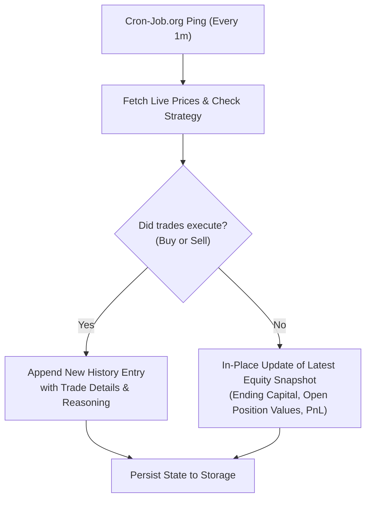

# Live Trading Execution Guide

> **SutharLabs Stock Simulator — Background & Live Execution Architecture**

---

## Table of Contents

1. [Why "Always-On" Is Non-Trivial on Serverless](#why-serverless-matters)
2. [What "Live Trading" Means in This Context](#what-live-means)
3. [Execution Methods Comparison](#comparison-table)
4. [Option 1 — Vercel Cron Jobs (Native)](#option-1-vercel-cron)
5. [Option 2 — Cron-Job.org (Free External Cron & 1-Minute Schedules)](#option-2-cronjob-org)
6. [Simultaneous Multi-Simulation Tracking](#simultaneous-multi-simulation-tracking)
7. [Smart Selective Logging (Preventing Log Bloat)](#smart-selective-logging)
8. [Option 3 — Client-Side Polling (UI Session)](#option-3-client-polling)
9. [Option 4 — GitHub Actions Scheduled Workflow](#option-4-github-actions)
10. [Option 5 — Upstash QStash (Serverless Queue)](#option-5-upstash-qstash)
11. [Securing the Endpoint](#securing-the-endpoint)
12. [Vercel Blob State Persistence](#vercel-blob-persistence)
13. [Data Source Limitations (Yahoo Finance)](#data-source-limits)
14. [Recommended Setup](#recommended-setup)

---

## Why Serverless Matters

The SutharLabs website is deployed on **Vercel Serverless Functions**. This has critical architectural implications:

| Property | Traditional Server (VPS/Docker) | Vercel Serverless |
|---|---|---|
| Process lifetime | Continuous, 24/7 | Terminates after each request |
| `setInterval` / background loops | Work indefinitely | Killed when request ends |
| Max execution time | Unlimited | **60 seconds** (Hobby), **800s** (Pro + Fluid) |
| Persistent in-memory state | Survives between requests | Wiped on every cold start |
| WebSocket support | Native | Requires external relay (Pusher/Ably) |

**Consequence**: The simulator cannot "watch markets" on its own. It must be **woken up** by an external trigger (HTTP request, cron, webhook) every time it needs to run.

---

## What "Live Trading" Means Here

In this simulator, "live" does **not** mean connecting to a broker and submitting real orders. It means:

1. **Fetching live market quotes** from Yahoo Finance for each tracked symbol
2. **Evaluating the active strategy** against real-time price and indicator data
3. **Executing simulated buy/sell orders** against the paper portfolio balance
4. **Persisting the updated portfolio** to Vercel Blob storage so it survives across function restarts

The key endpoint that performs all of this is:

```
POST https://www.sutharlabs.com/api/workspace/stock-analyzer/simulator/run-eod
GET  https://www.sutharlabs.com/api/workspace/stock-analyzer/simulator/run-eod
```

> [!IMPORTANT]
> **Always use `www.sutharlabs.com`:** Vercel automatically issues an HTTP `308 Permanent Redirect` from `sutharlabs.com` to `www.sutharlabs.com`. Cron-Job.org does not follow redirects by default, so calling `sutharlabs.com` directly will fail with `308 Permanent Redirect`.

> Both `GET` and `POST` are accepted. External cron services typically send `GET` requests, while the dashboard UI sends `POST` with a JSON body.

---

## Execution Methods Comparison

| Method | Frequency | Always-On | Cost | Setup Effort |
|---|---|---|---|---|
| **Vercel Cron (Hobby)** | Max 1/day | Yes | Free | Minimal |
| **Vercel Cron (Pro)** | Up to 1/min | Yes | $20/mo | Minimal |
| **Cron-Job.org** | Up to 1/min | Yes | **Free** | 5 min |
| **GitHub Actions** | Up to 1/5min | Yes | Free (2000 min/mo) | 10 min |
| **Upstash QStash** | 1/min | Yes | Free (500 msg/day) | 15 min |
| **Client-side Polling** | While tab is open | No (requires open tab) | Free | Already built |

---

## Option 1 — Vercel Cron Jobs (Native)

**Already configured** in `vercel.json`:

```json
{
  "crons": [
    {
      "path": "/api/workspace/stock-analyzer/simulator/run-eod",
      "schedule": "0 10 * * 1-5"
    }
  ]
}
```

### Current Schedule Explanation

| Field | Value | Meaning |
|---|---|---|
| Minute | `0` | At minute 0 |
| Hour | `10` | 10:00 UTC = **3:30 PM IST** |
| Day | `*` | Every day |
| Month | `*` | Every month |
| Weekday | `1-5` | Monday through Friday only |

This fires once per market-day at **3:30 PM IST** (approximately Indian market close).

### Upgrading to Per-Minute (Pro Plan)

On Vercel Pro, change the cron expression to run every 5 minutes during market hours:

```json
{
  "crons": [
    {
      "path": "/api/workspace/stock-analyzer/simulator/run-eod",
      "schedule": "*/5 3-10 * * 1-5"
    }
  ]
}
```

This fires every 5 minutes between 3:30 AM - 10:30 AM UTC (9:00 AM - 4:00 PM IST) on weekdays.

### Limitations

- **Hobby plan**: 2 crons maximum, minimum interval is **once per day**
- **Pro plan**: Unlimited crons, minimum interval is **once per minute**
- Vercel Cron does not send authentication headers — see Securing the Endpoint section below

---

## Option 2 — Cron-Job.org (Free External Cron)

This is the **recommended approach for live execution on the free Vercel Hobby plan**.

### Exact URLs to Configure

> [!WARNING]
> **Must include `www.` in the URL!**
> Vercel redirects apex `sutharlabs.com` to canonical `www.sutharlabs.com` with an HTTP `308 Permanent Redirect`. If you omit `www.`, Cron-Job.org will log a `308` error and will NOT trigger the simulation.

#### 1. Default Portfolio
```
https://www.sutharlabs.com/api/workspace/stock-analyzer/simulator/run-eod
```

#### 2. Specific Named Simulation Instance (e.g. `nifty_momentum`)
```
https://www.sutharlabs.com/api/workspace/stock-analyzer/simulator/run-eod?simulationId=nifty_momentum
```

#### 3. Fully Customized Simulation (Custom Strategy, Market & Sizing)
```
https://www.sutharlabs.com/api/workspace/stock-analyzer/simulator/run-eod?simulationId=us_tech_breakout&strategyId=strat-donchian-breakout&market=US&capitalAllocationPct=0.20
```

### Setup Steps for Cron-Job.org

1. Go to **https://cron-job.org** and create a free account.
2. Click **"Create cronjob"**.
3. Fill in the form:

| Field | Value |
|---|---|
| **Title** | SutharLabs — Live Simulation (`nifty_momentum`) |
| **URL** | `https://www.sutharlabs.com/api/workspace/stock-analyzer/simulator/run-eod?simulationId=nifty_momentum` |
| **HTTP Method** | `GET` |
| **Schedule** | Every 1 minute (`* * * * *`) or Every 5 minutes (`*/5 * * * *`) |
| **Notifications** | Enable email on failure |

4. For schedule:
   - **Every 1 minute (24/7)**: Set interval to `1 minute` or cron expression `* * * * *`
   - **Market Hours Only (Indian Market UTC)**: `* 3-10 * * 1-5` (every minute between 3:30 AM - 10:30 AM UTC = 9:00 AM - 4:00 PM IST, Mon-Fri)
   - **Market Hours Only (US Market UTC)**: `* 13-20 * * 1-5` (every minute between 1:30 PM - 8:00 PM UTC = 9:30 AM - 4:00 PM EDT, Mon-Fri)

5. Click **"Create"**. Cron-Job.org will ping your URL on schedule automatically.

---

## Simultaneous Multi-Simulation Tracking

The simulator supports running **unlimited concurrent simulations** in parallel. Each simulation instance is completely isolated with its own:
- Dedicated virtual cash ledger (`eod_portfolio_<simId>.json`)
- Dedicated audit history ledger (`eod_simulation_history_<simId>.json`)
- Independent strategy, market universe, and position sizing

### Supported Query / Payload Parameters

Any parameter can be passed either as a URL query param (for `GET` from Cron-Job.org) or in the JSON body (for `POST` from scripts):

| Parameter | Type | Default | Description |
|---|---|---|---|
| `simulationId` | string | `"default"` | Unique slug/ID identifying this simulation instance |
| `simulationLabel`| string | `simulationId` | Human-readable name displayed in the UI |
| `strategyId` | string | `"strat-ema-cross"`| Strategy model ID to evaluate (e.g. `strat-macd-div`, `strat-rsi-oversold`) |
| `market` | string | `"IN"` | Target market: `"IN"` (NSE), `"US"` (NYSE/NASDAQ), `"EU"` (Euronext) |
| `capitalAllocationPct`| number | `0.15` (15%) | Max capital allocated per trade |
| `trailingStopPct` | number | `3.0` (3%) | Trailing stop ratchet % below peak |
| `forcedCapital` | number | *preserved* | Override virtual cash starting balance |

### Example: Running 3 Different Strategies Concurrently on Cron-Job.org

You can set up 3 separate cron jobs on Cron-Job.org to compare performance across different models:

1. **Job 1 (Indian EMA Trend Following)**:
   ```
   https://www.sutharlabs.com/api/workspace/stock-analyzer/simulator/run-eod?simulationId=in_ema_trend&strategyId=strat-ema-cross&market=IN
   ```
2. **Job 2 (US RSI Dip Buyer)**:
   ```
   https://www.sutharlabs.com/api/workspace/stock-analyzer/simulator/run-eod?simulationId=us_rsi_dip&strategyId=strat-rsi-oversold&market=US
   ```
3. **Job 3 (Breakout Model with 25% Allocation)**:
   ```
   https://www.sutharlabs.com/api/workspace/stock-analyzer/simulator/run-eod?simulationId=breakout_heavy&strategyId=strat-donchian-breakout&market=IN&capitalAllocationPct=0.25
   ```

### Managing Simulations via API & UI

- **In the UI**: Use the **"Simulation Instance"** dropdown at the top of the Trade Simulator tab in the web dashboard to switch between instances, create new ones, or delete old ones.
- **List All Instances**:
  ```http
  GET /api/workspace/stock-analyzer/simulator/simulations
  ```
- **Inspect Specific History**:
  ```http
  GET /api/workspace/stock-analyzer/simulator/history?simulationId=in_ema_trend
  ```
- **Inspect Specific Portfolio**:
  ```http
  GET /api/workspace/stock-analyzer/simulator/portfolio?simulationId=in_ema_trend
  ```
- **Reset Specific Simulation**:
  ```http
  POST /api/workspace/stock-analyzer/simulator/reset
  Content-Type: application/json
  {"simulationId": "in_ema_trend", "initialCapital": 100000}
  ```

---

## Smart Selective Logging

### The 1-Minute Cron Problem
When Cron-Job.org pings an endpoint every 1 minute, it executes **1,440 requests per day**. If every run appended a new row to the history ledger:
- History would grow to **43,200 rows in a month**
- JSON payloads would exceed multiple megabytes
- Vercel function responses would slow down and hit memory limits
- Audit logs would be cluttered with thousands of identical "No trades" entries

### How SutharLabs Solves This
The simulator implements **smart event-based logging**:



1. **Trade Runs (`hadTrades: true`)**:
   - When a new stock is bought or an existing position hits take-profit / stop-loss.
   - Appends a new entry to `history` with execution price, friction, rationale, and timestamps.
2. **No-Trade Runs (`hadTrades: false`)**:
   - When prices fluctuate but no signals trigger.
   - **Does NOT create a new history row**.
   - Instead, silently updates the latest entry's portfolio valuation (`endingCapital`, `activePositions`, `netDailyPnL`) and updates current cash in `portfolio.json`.
3. **Audit Clarity**:
   - The UI displays an explicit badge: `Trade Executed (N trades)` vs `Equity Snapshot`.
   - Your audit ledger stays compact, meaningful, and fast forever.

---

## Option 3 — Client-Side Polling (UI Session)

When the **StockSimulatorPanel** dashboard tab is open in a user's browser, the React component can automatically trigger simulation runs on an interval. This requires no backend changes.

This is the **simplest "live" feel** — the simulation runs as long as the user has the page open.

### Implementation Approach

Add an auto-run interval in `src/components/StockSimulatorPanel.tsx`:

```typescript
const AUTO_RUN_INTERVAL_MS = 5 * 60 * 1000; // 5 minutes

useEffect(() => {
  if (!autoRunEnabled) return;

  const interval = setInterval(() => {
    runSimulation(); // existing function that calls POST /api/.../run-eod
  }, AUTO_RUN_INTERVAL_MS);

  return () => clearInterval(interval);
}, [autoRunEnabled]);
```

Add a toggle UI element to let the user enable/disable the auto-run loop.

---

## Option 4 — GitHub Actions Scheduled Workflow

If the repository is on GitHub, a free scheduled workflow can ping the endpoint.

Create `.github/workflows/live-simulation.yml`:

```yaml
name: Live Trade Simulation Trigger

on:
  schedule:
    # Run every 5 minutes during Indian market hours (Mon-Fri, 3:30 AM - 10:00 AM UTC)
    - cron: '*/5 3-10 * * 1-5'

jobs:
  trigger-simulation:
    runs-on: ubuntu-latest
    steps:
      - name: Ping SutharLabs simulator
        run: |
          curl -X GET \
            -H "X-Cron-Secret: ${{ secrets.CRON_SECRET }}" \
            -H "Accept: application/json" \
            --fail \
            --silent \
            "https://sutharlabs.com/api/workspace/stock-analyzer/simulator/run-eod"
```

### Setup
1. Go to **GitHub Repository -> Settings -> Secrets -> Actions**
2. Add a secret named `CRON_SECRET` with any random string value
3. Add the same value as `CRON_SECRET` in your Vercel environment variables

**Limits**: GitHub Actions free tier provides **2,000 minutes/month**. Each run costs ~5 seconds, so 5-minute polling uses roughly 600 minutes/month — well within the free tier.

---

## Option 5 — Upstash QStash (Serverless Queue)

Upstash QStash (https://upstash.com/docs/qstash) is a serverless message queue that can schedule recurring HTTP calls.

```bash
curl -X POST "https://qstash.upstash.io/v2/schedules" \
  -H "Authorization: Bearer YOUR_QSTASH_TOKEN" \
  -H "Content-Type: application/json" \
  -d '{
    "destination": "https://sutharlabs.com/api/workspace/stock-analyzer/simulator/run-eod",
    "cron": "*/5 * * * *",
    "method": "GET"
  }'
```

**Free tier**: 500 messages/day. At 5-minute intervals during a 9-hour market day, that is ~108 calls/day — well within limits.

---

## Securing the Endpoint

Since the simulator endpoint is unauthenticated (Vercel Cron and external services cannot easily send JWT tokens), add a simple **shared secret check** to prevent abuse.

### Step 1: Add Secret to Environment

Add to `.env` and to Vercel Dashboard environment variables:
```
CRON_SECRET=your-randomly-generated-secret-key
```

### Step 2: Validate in the Route

In `src/plugins/StockTracker/routes.ts`, update the run-eod handler:

```typescript
router.all(["/simulator/run-eod", "/simulator/run-eod/"], async (req: any, res: any) => {
  const cronSecret = process.env.CRON_SECRET;
  const incomingSecret = req.headers["x-cron-secret"] || req.query.secret;

  if (cronSecret && incomingSecret !== cronSecret) {
    const authHeader = req.headers["authorization"];
    if (!authHeader || !authHeader.startsWith("Bearer ")) {
      return res.status(401).json({ error: "Unauthorized" });
    }
  }

  const payload = req.method === "GET" ? req.query : (req.body || {});
  const report = await runEODSimulation(payload);
  res.json(report);
});
```

---

## Vercel Blob State Persistence

Portfolio and simulation history are automatically synced to **Vercel Blob** storage after every simulation run:

- Portfolio survives Vercel serverless function cold starts
- Trade history is available across all geographic regions
- State is retained between automatic cron triggers

**Files stored in Blob:**

| Blob Pathname | Contents |
|---|---|
| `stock-analyzer/eod_portfolio.json` | Current cash, open positions, P&L counters |
| `stock-analyzer/eod_simulation_history.json` | Last 100 simulation run reports |
| `stock-analyzer/strategies.json` | User-saved custom strategy configurations |

**Blob Store**: `store_ARuSzQjFrr9BrAUZ` (configured in `.env`)

---

## Data Source Limitations (Yahoo Finance)

The simulator uses **yahoo-finance2** to fetch market data:

| Data Type | Update Frequency | Useful For |
|---|---|---|
| `quote` (real-time price) | ~15 min delayed (free) | Intraday checks every 15+ min |
| `historical` (daily OHLCV) | End of day | Daily EOD strategy evaluation |
| `chart` (intraday candles) | 1-5 min bars | Higher-frequency intraday evaluation |

**Practical conclusion**: Running the simulation **every 5-15 minutes** is the sweet spot. More frequent runs will return the same cached price data and waste API quota.

For true tick-by-tick live data, a paid data provider (e.g., Polygon.io, Alpaca, or Zerodha Kite) would need to replace the Yahoo Finance integration.

---

## Recommended Setup

### For Development / Testing
Use the **UI "Run Simulation" button** manually to trigger individual runs on demand.

### For Production — Free Tier (Current Setup)
1. **Vercel Cron** at `0 10 * * 1-5` — fires once at Indian market close (already configured in `vercel.json`)
2. **Cron-Job.org** pinging the URL below every 5 minutes during market hours:
   ```
   https://sutharlabs.com/api/workspace/stock-analyzer/simulator/run-eod
   ```

### For Production — Full Live (Vercel Pro)
1. Upgrade to Vercel Pro ($20/month)
2. Change `vercel.json` cron to `*/5 3-10 * * 1-5` for every-5-min intraday execution
3. Keep Vercel Blob for portfolio persistence — no changes needed

### Architecture Overview

```
TRIGGER SOURCES
================
  Vercel Cron            Cron-Job.org          Browser Tab
  (EOD, 3:30 PM IST)    (every 5 min)         (client polling)
        |                      |                      |
        +----------+-----------+                      |
                   |                    --------------+
                   v
  GET/POST https://sutharlabs.com/api/workspace/stock-analyzer/simulator/run-eod
                   |
                   v
  VERCEL SERVERLESS FUNCTION
  ===========================
  1. Load portfolio  <--  Vercel Blob (persistent)
  2. Fetch quotes    <--  Yahoo Finance (live/delayed)
  3. Evaluate strategy rules
  4. Execute simulated trades
  5. Save portfolio  -->  Vercel Blob (persistent)
  6. Return JSON report
```

---

*Last updated: 2026-10-07*

*Relevant files:*
- `vercel.json` — Cron job configuration
- `src/plugins/StockTracker/routes.ts` — run-eod endpoint
- `src/plugins/StockTracker/simulator/tradeSimulator.ts` — simulation engine
- `src/services/blobStorage.ts` — Vercel Blob persistence
- `.env` — BLOB_STORE_ID, BLOB_READ_WRITE_TOKEN, BLOB_WEBHOOK_PUBLIC_KEY
