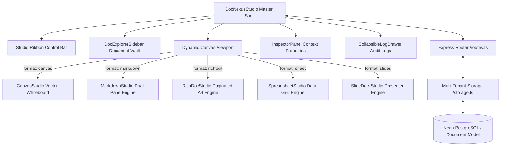

# DocNexus Studio: Architecture, Logic & Systems Specification

> **Version:** v0.3.0 (Production Release)  
> **Plugin ID:** `wp_doc_nexus`  
> **Route:** `/workspace/docnexus`  
> **Inspiration / Parity:** AFFiNE (Doc vs Edgeless Canvas), Outline (Command Palette & Wiki Docs), Canva, Adobe Acrobat, Excalidraw  
> **Security Standard:** AES-256-GCM Package Encryption, SHA-256 Release Fingerprinting  

---

## 1. Executive Summary

**DocNexus Studio** is an omni-format creative document processing engine and design suite designed for the SutharLabs platform.

Traditional developer documentation tools restrict developers and architects to pure Markdown, forcing them to switch across disparate third-party applications when designing cloud architecture diagrams, compiling formal A4 executive charters, analyzing project cost matrices, or building presentation pitch decks.

DocNexus eliminates tool fragmentation by providing a unified workspace that seamlessly handles **5 native document paradigms**:
1. **Visual Vector Canvas** (Canva & Adobe Illustrator style graphic whiteboard)
2. **Technical Markdown Studio** (Notion & Obsidian style synchronized split-pane editor)
3. **Paginated Executive Document** (Adobe Acrobat & Google Docs style A4 publisher)
4. **Data Grid & Spreadsheet** (Canva Tables & Excel style tabular matrix with formulas)
5. **Slide Deck Studio** (Canva Presentations & Pitch style multi-slide presenter)

---

## 2. Core Architecture & Component Hierarchy

DocNexus follows the SutharLabs decoupled plugin architecture:



### Component Breakdown
* **`DocNexusStudio.tsx`**: The master workspace shell. Coordinates active document selection, title renaming, auto-save / manual persistence, export dialogs, template library modals, and collapsed views.
* **`DocExplorerSidebar.tsx`**: Left navigation drawer. Features real-time search queries, format filtering (`ALL`, `canvas`, `markdown`, `richtext`, `sheet`, `slides`), 1-click duplication, deletion, and template triggers.
* **`CanvasStudio.tsx`**: Interactive SVG vector canvas. Supports geometric shapes, sticky notes, directional flow arrows, status badges, drag-and-drop movement, resize handles, and color palette presets.
* **`MarkdownStudio.tsx`**: Synchronized split-pane markdown compiler. Includes Table of Contents parser, sequence diagram compiler, network topology visualizer, sortable markdown table grid, and 1-click code copying.
* **`RichDocStudio.tsx`**: Paginated executive document publisher. Renders realistic A4 and Letter sheets with page numbers, diagonal watermarks (`CONFIDENTIAL`, `OFFICIAL`, `DRAFT`), running headers/footers, and print-to-PDF layout.
* **`SpreadsheetStudio.tsx`**: Tabular matrix grid. Enables dynamic column additions/renaming, cell data types (Text, Currency ₹, Number, Status, Date), summary calculation rows (SUM, COUNT), and RFC 4180 CSV export.
* **`SlideDeckStudio.tsx`**: 16:9 presentation slide deck. Features bottom slide thumbnail timelines, layout presets, and a dedicated **Fullscreen Presenter Mode** with keyboard arrow navigation.
* **`InspectorPanel.tsx`**: Context-sensitive properties drawer on the right. Inspects and configures vector properties for canvas elements, document metrics for markdown, paper geometry for rich documents, and layout themes for slide decks.

---

## 3. Data Contracts & State Specifications

All models are strongly typed in [`src/plugins/DocNexus/types.ts`](file:///d:/Code/SutharLabs/website/src/plugins/DocNexus/types.ts):

### A. Master Document Model (`DocNexusDocument`)
```typescript
export interface DocNexusDocument {
  id: string;
  title: string;
  format: 'canvas' | 'markdown' | 'richtext' | 'sheet' | 'slides';
  content: string; // Serialized JSON state for canvas/sheet/slides/doc or raw text for markdown
  metadata: {
    format?: DocumentFormat;
    tags?: string[];
    category?: string;
    isPinned?: boolean;
    authorEmail?: string;
    wordCount?: number;
    elementCount?: number;
    theme?: string;
  };
  createdAt: string;
  updatedAt: string;
}
```

### B. Canvas Scene State (`CanvasSceneState`)
```typescript
export interface CanvasSceneState {
  elements: CanvasElement[];
  width: number;
  height: number;
  backgroundColor: string;
  gridSnap: boolean;
  aspectRatio: 'A4' | '16:9' | 'Square' | 'Infinite';
}

export interface CanvasElement {
  id: string;
  type: 'rect' | 'circle' | 'diamond' | 'text' | 'sticky' | 'arrow' | 'badge' | 'card';
  x: number;
  y: number;
  width: number;
  height: number;
  rotation?: number;
  zIndex: number;
  text?: string;
  fill?: string;
  stroke?: string;
  strokeWidth?: number;
  textColor?: string;
  fontSize?: number;
  borderRadius?: number;
  shadow?: boolean;
}
```

---

## 4. Multi-Tenant Backend & Persistence Logic

The persistence layer ([`storage.ts`](file:///d:/Code/SutharLabs/website/src/plugins/DocNexus/storage.ts)) provides:

1. **User Tenant Segregation**:
   Every document is scoped by the caller's email (`req.user.email`). Documents belonging to one developer cannot be viewed or modified by another.
2. **First-Visit Auto-Seeding**:
   When a user accesses DocNexus for the first time, the storage engine seeds 5 preloaded blueprint documents showcasing each format:
   * *Distributed Cloud Architecture Canvas* (`canvas`)
   * *Enterprise Software Architecture Spec* (`markdown`)
   * *Enterprise Software Engineering Charter* (`richtext`)
   * *Cloud Infrastructure Operational Budget* (`sheet`)
   * *SutharLabs Sovereign Suite Pitch Deck* (`slides`)
3. **Database & Memory Cache Fallback**:
   Documents are asynchronously synchronized to Neon PostgreSQL via Prisma (`prisma.document`). If database connectivity is degraded, the engine safely persists state in memory and SQLite caches.

---

## 5. REST API Controller

Mounted under `/api/plugins/wp_doc_nexus/` with JWT token verification:

| Method | Endpoint | Payload | Response | Description |
| :--- | :--- | :--- | :--- | :--- |
| `GET` | `/templates` | — | `DocTemplate[]` | Preloaded blueprint gallery |
| `GET` | `/documents` | — | `DocNexusDocument[]` | List all user documents |
| `POST` | `/documents` | `{ title, format, templateId, content }` | `DocNexusDocument` | Create new document |
| `GET` | `/documents/:id` | — | `DocNexusDocument` | Retrieve document details |
| `PUT` | `/documents/:id` | `{ title, format, content, metadata }` | `DocNexusDocument` | Update document content |
| `DELETE`| `/documents/:id` | — | `{ success: boolean }` | Remove document |
| `POST` | `/documents/:id/duplicate` | — | `DocNexusDocument` | Clone document |
| `GET` | `/document` | — | `{ id, title, content }` | Backward compatibility guide |
| `POST` | `/document` | `{ title, content }` | `{ id, title, content }` | Backward compatibility guide save |

---

## 6. Universal Export Hub

DocNexus supports multi-format artifact export via [`ExportModal.tsx`](file:///d:/Code/SutharLabs/website/src/plugins/DocNexus/components/ExportModal.tsx):
* **Print / Vector PDF**: Formatted for browser vector printing with true page boundaries and margins.
* **Markdown (`.md`)**: Exports clean, portable Markdown with YAML frontmatter.
* **Styled Standalone HTML (`.html`)**: Self-contained HTML file with embedded CSS styling.
* **RFC 4180 CSV (`.csv`)**: Tabular data extraction for spreadsheet documents.
* **Nexus Project Archive (`.nexus`)**: Native JSON backup preserving vector positions, slide layouts, and custom formatting.
